# Hello, Profile README

I'm duskmoon (Campbell He), a common PhD student at Tsinghua University

> Powered by [anuraghazra/github-readme-stats](https://github.com/anuraghazra/github-readme-stats)

## My tech stack

### Languages

| Type | Languages |
|-|-|
| Currently Using |    |
| Used to use |   |
| Learning |  |

### Working on

 -E95420?style=for-the-badge&logo=ubuntu&logoColor=white)

-000000?style=for-the-badge&logo=apple&logoColor=white)

